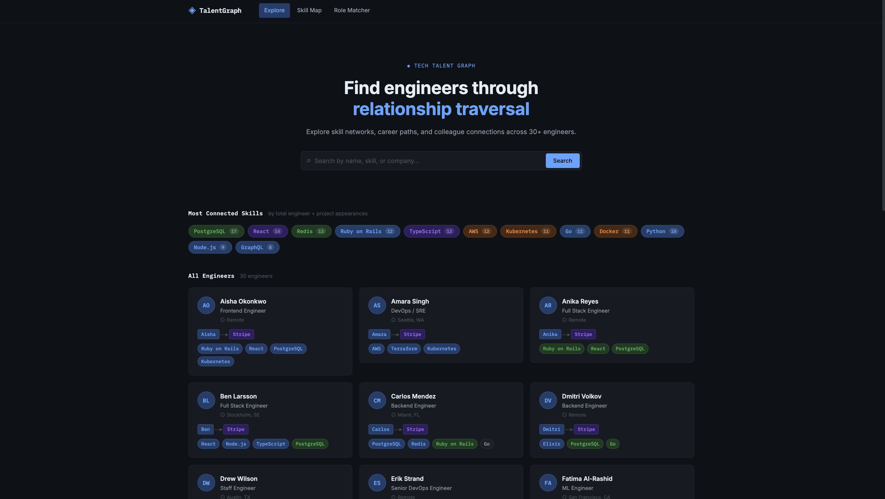
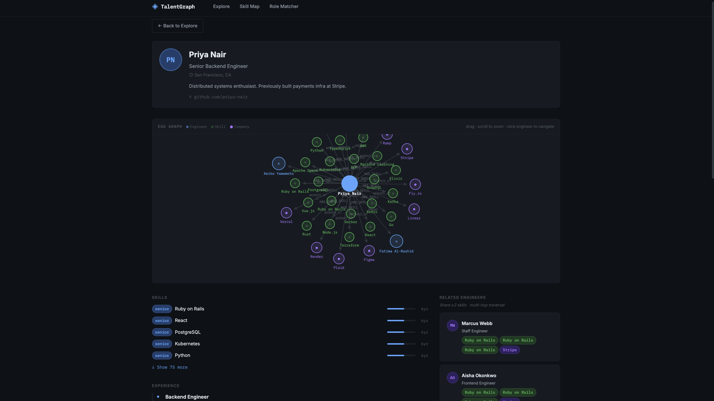
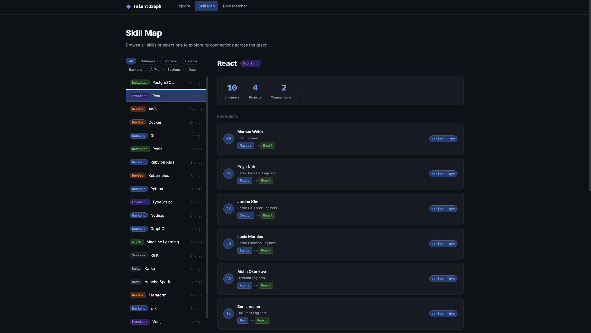
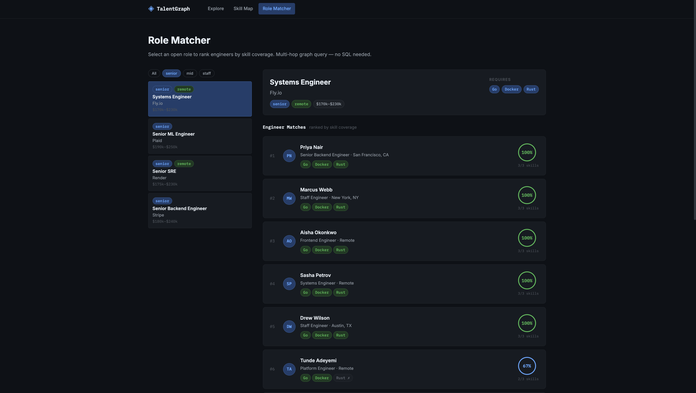
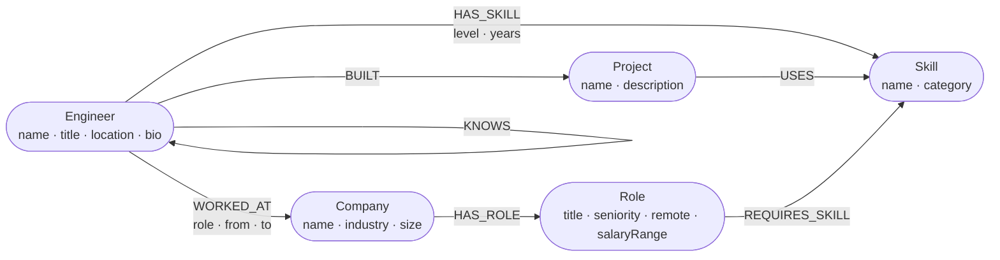

# TalentGraph

A graph database application that maps engineers, skills, companies, and open roles as a connected graph — backed by CognoDB (Neo4j-compatible) and built with Node.js + React.

**Live demo:** https://graphapp-production-146c.up.railway.app

**Screen recording:** *Loom link*

---

## Use Case

TalentGraph answers relationship questions that relational databases make hard:

- *Which engineers know both Rails and Kubernetes and have worked at a fintech company?*
- *Who are the engineers closest to me who share 3+ skills?*
- *Which engineers best match this open role, and what skills are they missing?*

These are fundamentally graph traversal problems. The data is a web of engineers connected to skills, to companies, to projects, and to each other — not rows in a table.

## Screenshots

| Explore | Engineer Profile |
|---|---|
|  |  |

| Skill Map | Role Matcher |
|---|---|
|  |  |

## Why a Graph Database?

**The SQL comparison:** Finding "engineers who share ≥2 skills AND have worked at the same company" in SQL requires:

```sql
SELECT e2.*
FROM engineers e1
JOIN engineer_skills es1 ON e1.id = es1.engineer_id
JOIN engineer_skills es2 ON es1.skill_id = es2.skill_id AND es2.engineer_id != e1.id
JOIN engineer_companies ec1 ON e1.id = ec1.engineer_id
JOIN engineer_companies ec2 ON ec1.company_id = ec2.company_id AND ec2.engineer_id = e2.id
JOIN engineers e2 ON e2.id = es2.engineer_id
WHERE e1.id = $id
GROUP BY e2.id HAVING COUNT(DISTINCT es1.skill_id) >= 2;
```

**In Cypher, the same query is one readable pattern:**

```cypher
MATCH (me:Engineer {id: $id})-[:HAS_SKILL]->(s:Skill)<-[:HAS_SKILL]-(other)
WITH me, other, collect(s.name) AS sharedSkills WHERE size(sharedSkills) >= 2
OPTIONAL MATCH (me)-[:WORKED_AT]->(c:Company)<-[:WORKED_AT]-(other)
RETURN other, sharedSkills, collect(c.name) AS sharedCompanies
```

Additionally, "shortest skill path between two engineers" is a variable-length path query with no clean SQL equivalent — it requires recursive CTEs with unbounded depth. In Cypher: `shortestPath((a)-[:HAS_SKILL|KNOWS*..6]-(b))`.

## Data Model



| Node | Properties |
|---|---|
| `Engineer` | `id`, `name`, `title`, `location`, `bio`, `github` |
| `Skill` | `id`, `name`, `category` (Backend/Frontend/DevOps/Database/AI·ML/Data/Systems) |
| `Company` | `id`, `name`, `industry`, `size`, `location` |
| `Project` | `id`, `name`, `description` |
| `Role` | `id`, `title`, `seniority`, `remote`, `salaryRange` |

| Relationship | Properties |
|---|---|
| `HAS_SKILL` | `level` (junior/mid/senior), `years` |
| `WORKED_AT` | `role`, `from`, `to` |
| `HAS_ROLE` | — |
| `REQUIRES_SKILL` | — |
| `BUILT` | — |
| `USES` | — |
| `KNOWS` | — |

**Seed data:** 30 engineers · 20 skills · 10 companies · 15 projects · 8 open roles

## Main Queries Explained

### 1. Multi-hop colleague discovery (3-hop traversal)
```cypher
MATCH (me:Engineer {id: $id})-[:HAS_SKILL]->(s:Skill)<-[:HAS_SKILL]-(other:Engineer)
WHERE other.id <> $id
WITH me, other, collect(s.name) AS sharedSkills
WHERE size(sharedSkills) >= 2
OPTIONAL MATCH (me)-[:WORKED_AT]->(c:Company)<-[:WORKED_AT]-(other)
RETURN other, sharedSkills, collect(DISTINCT c.name) AS sharedCompanies
ORDER BY size(sharedSkills) DESC
```
Traverses Engineer → Skill ← Engineer (skill co-occurrence) then Engineer → Company ← Engineer (shared employer). Combines two independent 2-hop paths into a single result — awkward in SQL without multiple self-joins.

### 2. Shortest skill bridge between engineers (variable-length path)
```cypher
MATCH path = shortestPath(
  (a:Engineer {id: $fromId})-[:HAS_SKILL|KNOWS*..6]-(b:Engineer {id: $toId})
)
RETURN nodes(path), length(path) AS hops
```
Uses Neo4j's built-in `shortestPath` over a heterogeneous relationship type list. The `*..6` means "up to 6 hops." This is a recursive graph problem; SQL has no built-in equivalent without recursive CTEs and pre-computed adjacency tables.

### 3. Role matcher — engineers ranked by skill coverage
```cypher
MATCH (r:Role {id: $roleId})-[:REQUIRES_SKILL]->(required:Skill)
WITH r, collect(required) AS requiredSkills, collect(required.id) AS requiredIds
MATCH (e:Engineer)-[:HAS_SKILL]->(s:Skill) WHERE s.id IN requiredIds
WITH r, requiredSkills, e, collect(DISTINCT s) AS matched
RETURN e, matched,
  [s IN requiredSkills WHERE NOT s.id IN [ms IN matched | ms.id]] AS missing,
  toFloat(size(matched)) / size(requiredSkills) AS matchScore
ORDER BY matchScore DESC
```
Finds the set difference between required skills and owned skills per engineer, then ranks by coverage ratio. The list comprehension `[s IN requiredSkills WHERE NOT ...]` is graph-native — no outer join needed.

### 4. Most connected skills
```cypher
MATCH (s:Skill)
OPTIONAL MATCH (e:Engineer)-[:HAS_SKILL]->(s)
OPTIONAL MATCH (p:Project)-[:USES]->(s)
RETURN s.name, count(DISTINCT e) + count(DISTINCT p) AS connections
ORDER BY connections DESC LIMIT 12
```
Aggregates across two different relationship types in one pass. Shows which skills are most embedded in the graph.

## Setup

### 1. Provision a CognoDB instance

1. Go to [console.cognodb.com/signup](https://console.cognodb.com/signup) and create an account (no credit card required)
2. Create a free **c0** instance and pick a region — it provisions in under a minute
3. Copy your connection URI (format: `bolt+s://<instance-id>.databases.cognodb.cloud`) and generated password
   > The password is shown **exactly once** — copy it immediately
4. Your username is always **`cognodb`**

### 2. Configure environment

```bash
cp .env.example .env
```

Edit `.env`:
```
NEO4J_URI=bolt+s://<instance-id>.databases.cognodb.cloud
NEO4J_USER=cognodb
NEO4J_PASSWORD=<your-password>
PORT=3001
```

### 3. Install and seed

```bash
npm install
cd client && npm install && cd ..
npm run seed
```

The seed script creates all nodes, relationships, and indexes. Takes ~10 seconds.

### 4. Run locally

```bash
npm run dev
```

- React client: http://localhost:5173
- API server: http://localhost:3001
